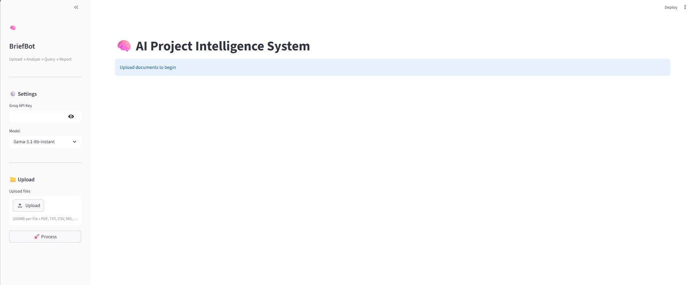
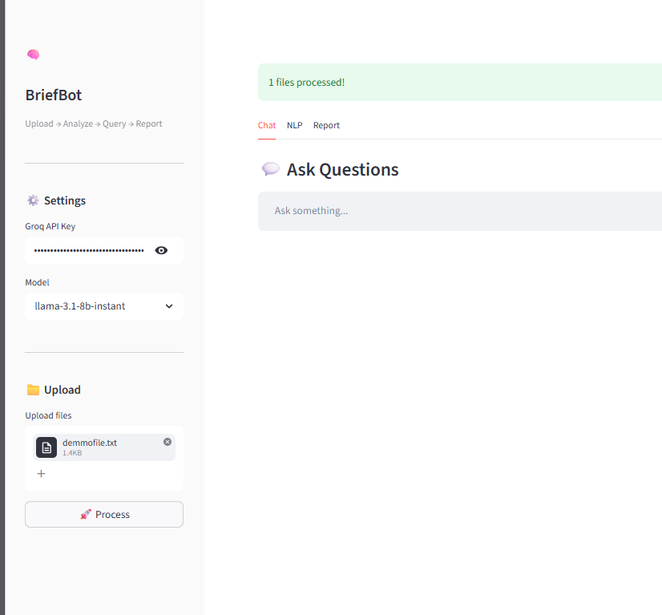
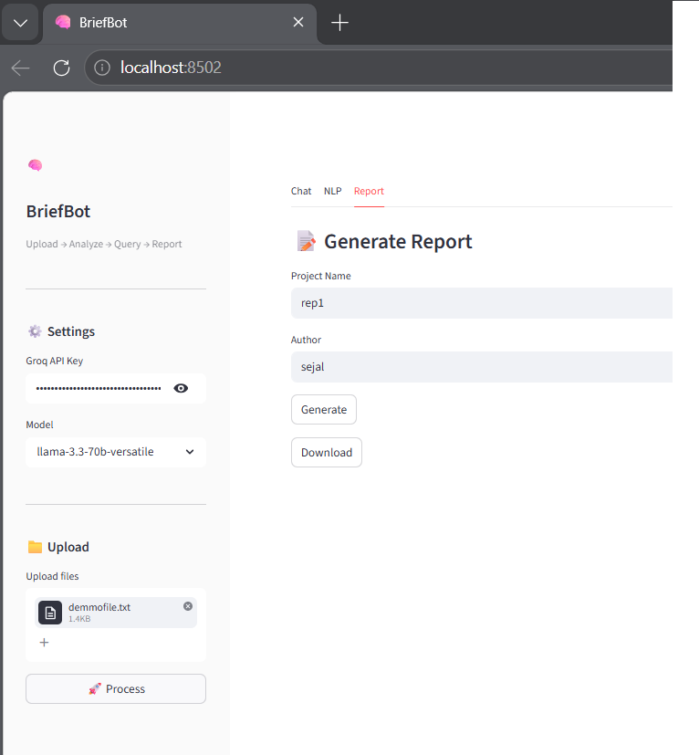
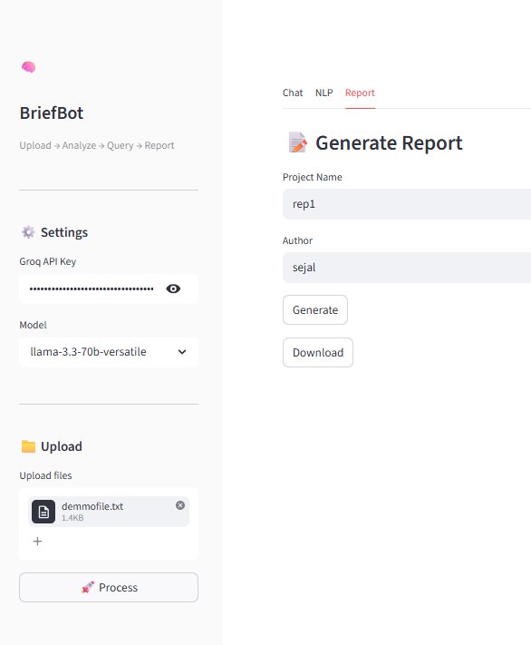

# Breifbot

A Streamlit app for analyzing project documents with RAG querying, NLP insights, and automated report generation using free Groq API.

🚀 **Live Demo:** [Try the App](https://breifbot.streamlit.app/)

## Features
- Upload PDF, TXT, CSV, MD, JSON files
- RAG-based Q&A with source citations
- NLP: sentiment, keywords, key phrases, readability
- Generate Markdown reports with summaries, risks, actions
- Conversational chat with memory
- Local embeddings (sentence-transformers) + FAISS index

## Quick Start
1. `pip install -r requirements.txt`
2. Get free Groq API key at console.groq.com
3. `streamlit run app.py`
4. Sidebar: API key → Upload files → Process
5. Tabs: Chat | NLP | Report

## Architecture
Streamlit UI → FileHandler → RAGPipeline (chunk/embed/retrieve/Groq) + NLPAnalyzer (NLTK) → ReportGenerator

## Tech Stack
- Frontend: Streamlit
- LLM: Groq (Llama3)
- Embeddings: sentence-transformers all-MiniLM-L6-v2
- Vector DB: FAISS
- NLP: NLTK, VADER
- PDF: pdfplumber

## 📸 Screenshots

  
  

  
  

## Use Cases
- Query project logs: 'What risks?'
- NLP on meeting notes
- Daily reports from multiple docs

## Tests
`pytest tests/ -v`

MIT License. Author: Sejal"
</xai:function_call >

<xai:function_call name="edit_file">
<parameter name="path">TODO.md
